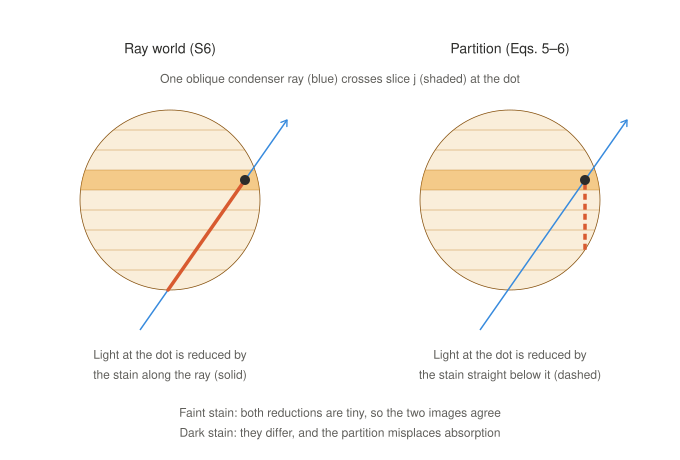

# Study notes: dark nodes, the partition and the ray world (2026-10-07)

| Date | Change |
|---|---|
| 2026-10-07 | Created at the user's request (18:17 Europe/Rome), for study on 2026-10-08. Copies two answers of the theory chat of 2026-10-07 (claude.ai session `session_01VvzYj2wa7J3oP8EEw71KEg`): the answer of 17:02 to "give a context on this and explain better" and the answers of 18:01 to questions 1-5. Text unchanged except that housekeeping lines (docs written, push status) are removed and later outcomes are marked in brackets. The figure is a standalone copy of the one shown in the chat. |

Status of what these notes discuss: D-030, D-031 and D-032 are in the
project log `TEEG_decisions_and_ideas_log.md`; the code consequences are in
`TEEG_diameter_implementation_handoff_2026-10-06.md` (v1.6, this folder).

---

## Part 1 -- Answer of 17:02: context and a better explanation of what happens near $\alpha \approx 1$

The user's message it answered: the restatement of D-024 (ii) ("flags any
node whose fitted $\hat\alpha_i=\hat\mu_i\hat d_i/\cos\varphi_i>1.0$ and
removes it from the selection $\mathcal S$ ... gets its value from neighbours
... instead of its own corrected fit"), with the user's reply "This should not
happen. Regardless the optical depth we estimate the diameter of ALL the real
nodes" (logged as D-030), followed by the three effects near $\alpha \approx 1$
and "Now please give a context on this and explain better".

**D-030 is logged:** every real node gets its own corrected diameter, whatever
its optical depth. The selection $\mathcal S$ is applied identically to
phantoms and real nodes. So the condition $\hat\alpha\le1.0$ leaves
$\mathcal S$ for both; otherwise the table would not describe the nodes it
corrects. I kept the threshold only as a `dark` label that no fill rule reads.
That is my proposal and is marked open in the entry.

One new open point comes with D-030 (comment (b)). At fixed $(d,\varphi)$ the
fit's bias now changes with darkness, so $\log\mu$ (or $\hat\alpha$) may need
to become a third table axis. **[Settled at 18:01 by D-031: $\hat\alpha$ is
the third axis.]** D-030 is also why the passage below now matters: its three
effects now reach the final diameters of dark nodes.

### Where we are

The workstream is diameter re-measurement on Allen's 63× brightfield z-stacks
of DAB-stained human neurons (specimen 529878215).
- **Fit:** for each node, the pipeline fits the profile across the branch
  with a blurred Beer–Lambert tube (D4, as amended by D-018 and D-019). This
  gives $\hat\mu_i$ and $\hat d_i$.
- **Correction:** $\hat d_i$ is then corrected with the bias table
  $\hat m(d,\varphi\mid\mathcal C)$. The table is built by rendering phantoms
  of known $d$, fitting them the same way, and inverting (procedure
  §3.5–3.9, D-024).

The passage says for which nodes the renderer draws the right picture. The
correction is only as good as that picture. This is where the renderer sits:

- real node → fit → $\hat\mu_i,\hat d_i,\varphi_i$ → $\hat\alpha_i$
- phantom $(d,\mu,\varphi)$ → renderer (partition, kernel $K_\delta$) → same
  fit → table $\hat m$ and its spread $\hat\tau$ → inversion → corrected
  $\tilde d_i$, now for every node (D-030)

If the renderer is wrong for dark tubes, the table is wrong for dark nodes,
and $\hat\tau$ does not show it.

Some quantities exist on two levels. The fit estimates the truth, and the
table maps $\hat d_i$ back toward $d$:

| quantity | model level: truth (known only for phantoms) | computed level: from the fit | status |
|---|---|---|---|
| optical depth on the vertical ray through the axis (dimensionless) | $\alpha=\mu d/\cos\varphi$ | $\hat\alpha_i=\hat\mu_i\hat d_i/\cos\varphi_i$ | $\alpha$: configured (phantom draw) / derivation-only (real); $\hat\alpha_i$: computed |
| stain absorption coefficient (µm⁻¹) | $\mu$ | $\hat\mu_i$ | $\mu$: configured / derivation-only; $\hat\mu_i$: measured |
| diameter (µm) | $d$ | $\hat d_i$ (fit), $\tilde d_i$ (after the table) | $d$: configured / derivation-only; $\hat d_i$: measured; $\tilde d_i$: computed |

The renderer's own objects:

| symbol / term | meaning | type, units | status |
|---|---|---|---|
| slice $j$ at depth $\zeta_j$ | the object cut into thin horizontal slabs, numbered in the order the light meets them | index; µm | configured |
| $a_j(x,y)$ | optical depth of slice $j$ on the vertical through $(x,y)$ | $\ge0$, dimensionless | computed (renderer) |
| $T_{<j}(x,y)$ | the **history**: fraction of light left after the slices met before $j$ | $(0,1]$ | computed (renderer) |
| $\Delta A_j(x,y)$ | fraction of the background light absorbed in slice $j$ | $[0,1)$ | computed (renderer) |
| $K_\delta$ | defocus kernel at $\delta=\zeta_j-z_k$: circular Gaussian of width $\sigma_{\rm r}(\delta)$ | unit-area function on $\mathbb R^2$, µm⁻² | configured (example table, $\gamma=0.79$) / measured after D-026, D-027 |
| $T_{\rm c}$ | $e^{-\alpha}$: light left on the vertical ray through the axis | $(0,1]$ | derivation-only |
| partition | the default renderer (procedure Eqs. 5–6) | method | configured (D-024 (i)) |
| ray world | geometric-optics renderer: Beer–Lambert along every oblique ray of the condenser cone, (S6) | method | configured option `ray_world`; used as the reference |
| weak-object approximation | the image is the transmittance blurred by an intensity PSF, valid to first order in absorbance | assumption | not verified for our data |

### What happens near α ≈ 1, and why it matters now

The weak link in that chain, for dark nodes, is the renderer's picture. The
naive view is that a darker node is just a higher-contrast node: same blur,
same correction, deeper dip. Past $\alpha\approx1$ that is false, because
darkness changes *where* inside the node the light is absorbed.

On the vertical ray through the axis, Beer–Lambert gives
$1-T_{\rm c}=1-e^{-\alpha}$. At $\alpha=1$ the node removes 63 % of the light,
and its far side receives only 37 %. In plain terms, the half of the node the
light meets first does most of the absorbing, and the other half sits in its
shadow. Three different things follow from this, and they differ in kind:

1. **Saturation and self-shadowing: real physics, and modelled.** The fit and
   both renderers apply Beer–Lambert exactly along the lines they use:
   vertical for the fit and the partition, the cone's rays for the ray world.
   Nothing needs fixing. This is, however, why the shadow's shape depends on
   $\mu$ as well as $d$ (D-030 comment (b)).
2. **The partition's bookkeeping: an artefact of our renderer.**
   - In a faint node, every slice receives almost all the light, whatever
     path it came by. So it does not matter along which line the renderer
     computes the light reaching a slice.
   - In a dark node, the light reaching a slice depends strongly on the path.
     Computing it along the vertical line, instead of along the condenser's
     oblique rays, puts the absorption in the wrong place.
   - In our tests this draws dark tubes *lighter* in the centre the darker
     they are, and pulls their focus toward the light. The ray world shows
     neither effect.
3. **First-order image formation: real physics, modelled nowhere.** With a
   partially coherent condenser, light diffracted by different parts of a
   dark object interferes. The "blurred transmittance" form holds only to
   first order in absorbance (optics §3.6). Nobody knows how large the error
   is at $\alpha\approx1$.

**Correction to an earlier message:** I blamed "splitting the absorbed light
among depth slices and blurring each one separately". The slicing and the
per-slice blur are not the fault. The same slicing, with the history computed
along each ray, is exact in geometric optics ((S7)/(S8), below). The fault is
*where* the history $T_{<j}$ is computed.

Where each effect stands:
- **Effect 1** is handled.
- **Effect 2** is known, measured and testable: the ray world is the check
  for how absorption is treated.
- **Effect 3** is open, with one indirect check on real data. Coherent edges
  ring, so a bright fringe beside dark branches in the real profiles is a
  warning sign (optics §3.6).

With D-030 in force, and the partition still the table's renderer
(D-024 (i)), effects 2 and 3 pass into the final diameters of dark nodes. So
the planned study of the partition's failure (D-024 (i)) has to come before
those diameters can be trusted.

### The two renderers side by side

The equations show exactly where effect 2 comes from.

**Symbols.**
- $I_k$: intensity in output plane $k$ at depth $z_k$, in the units of the
  background $B$.
- $\hat s$: a direction in the condenser cone, with polar angle $\vartheta$
  and lateral slope $\mathbf t_{\hat s}=(s_x,s_y)/s_z$.
- $\langle\cdot\rangle_{\hat s}$: the average over the cone, with
  $(s_x,s_y)$ uniform on the disc of radius NA$/n_{\rm oil}=0.924$.
- $L(\mathbf x,z_k,\hat s)$: the length (µm) inside the tube of the line
  through $(\mathbf x,z_k)$ along $\hat s$.

**The partition** (procedure Eqs. 5–6):

$$T_{<j}(x,y)=\exp\Big(-\sum_{j'<j}a_{j'}(x,y)\Big),\qquad \Delta A_j(x,y)=T_{<j}(x,y)\big(1-e^{-a_j(x,y)}\big),\tag{5}$$

$$I_k(x,y)=B\Big[1-\sum_{j=1}^{J}\big(\Delta A_j*K_{\zeta_j-z_k}\big)(x,y)\Big].\tag{6}$$

**The ray world** (S6):

$$I^{\rm ray}_k(\mathbf x)=B\,\big\langle e^{-\mu L(\mathbf x,z_k,\hat s)}\big\rangle_{\hat s}.$$

**Rewritten slice by slice.** (S7)/(S8) write both as sums over slices along
each ray of the cone, taking the partition's kernel as the spread of those
same rays. Let $\mathbf x_j=\mathbf x+(\zeta_j-z_k)\,\mathbf t_{\hat s}$ be
the point where the ray crosses slice $j$:

$$I^{\rm ray}_k=B\Big[1-\Big\langle\sum_j T^{\rm ray}_{<j}\big(1-e^{-a_j(\mathbf x_j)/\cos\vartheta}\big)\Big\rangle_{\hat s}\Big]\quad\text{vs}\quad I^{\rm P}_k=B\Big[1-\Big\langle\sum_j T_{<j}(\mathbf x_j)\big(1-e^{-a_j(\mathbf x_j)}\big)\Big\rangle_{\hat s}\Big].$$

They differ in only two places:
- **The history.** $T^{\rm ray}_{<j}$ is the light left along the ray
  itself; $T_{<j}(\mathbf x_j)$ is the light left along the vertical line
  through the crossing point.
- **The path length in the slice:** $a_j/\cos\vartheta$ against $a_j$.

**Why they agree in faint stain.** For a single slice both histories equal 1.
In faint stain both tend to 1, and the path length only rescales $\mu$.
Matching $\mu$ through $\hat\mu$ absorbs that rescaling: the phantom value
$\mu_{\rm ph}$ that matches comes out at $\mu_{\rm ph}/\mu=1.450$ in the run,
against 1.447 predicted by (S10). The two renderers' $\hat d/d$ then differ by
only −0.002 at $\mu d=0.05$ and −0.005 at $\mu d=0.5$ [run].

**Why they part in dark stain.** The histories are now far from 1, and an
oblique ray has crossed different stain from the vertical line through its
crossing point. In the opaque limit, (S9) shows that the partition books less
than all the light as absorbed along an oblique ray through the centre point:
light leaks through an opaque tube. The path length also stops being a mere
rescaling. With the true history but vertical path elements, $\hat d/d$ shifts
by +0.009 / +0.021 / +0.050 at $\mu d$ = 0.5 / 1.5 / 3 [run].

The test runs on flat tubes (implementation handoff "Findings" (1)–(4), [run]):

| test | partition | ray world |
|---|---|---|
| in-focus centre dip, $d=1$ µm, $\mu d$ = 3 / 10 / 50, Debye kernel | 0.831 / 0.788 / 0.723 (lighter as darker) | opaque centre is black: 1.000 at $\mu d=50$ |
| same at $\mu d=50$, kernel of the same rays | 0.699, against 0.691 from (S9) | 1.000 |
| plane of best focus (negative = light side) | −1 for $d=1$ µm, $\mu d=1.5$; −3 for $d=2$ µm, $\mu d=2$; 0 for a faint $d=2$ µm, $\mu d=0.2$ | symmetric: dips at ±3 planes equal to four decimals |
| can a phantom $\mu$ reproduce the reference's $\hat\mu$? ($d=1$ µm) | yes at $\mu d\le0.5$; no at 1.5 or 3 | — |

So the break lies between $\mu d=0.5$ and 1.5, which is the band around
$\alpha\approx1$ the passage is about.

**What this does to a dark node's diameter.** Its correction comes from
phantoms drawn too light in the centre and focused on the wrong side. If real
dark nodes behave like the ray world, the correction is for a profile they do
not have. The sign and size of the resulting diameter error have not been
computed. Two checks:
- Render the same phantom draws with `ray_world` and compare their $\hat d$
  with the partition's. Compare differences only: the ray world has no
  diffraction, so its own $\hat d/d$ (1.20–1.32) is not a bias.
- For effect 3, look for bright fringes beside dark branches in the real
  profiles.

**Don't conflate the three effects.** They are three different
nonlinearities:

| | physics or artefact | modelled where | check |
|---|---|---|---|
| saturation / self-shadowing | physics | fit and both renderers, exactly along their lines | none needed |
| history along the vertical | artefact of the partition | absent from the ray world | partition vs `ray_world` |
| coherence (first-order image model) | physics | nowhere | fringes in real profiles |

So for dark nodes the question is only half resolved. The renderer's error is
known in kind, measured in our tests and checkable with the ray world; the
coherence error is real, unmeasured, and has only an indirect check.

**Sources:**
- **Knowledge base (repo docs, D-020):** D-024 and D-030 (project log);
  procedure Eqs. 5–6 and §3.9; mathematics §3.2; optics §3.6; implementation
  handoff (S6)–(S10) and "Findings". The numbers come from the committed
  check scripts, marked [run] there.
- **Textbook, from memory:** Beer–Lambert; Köhler illumination and Hopkins'
  partial-coherence theory, as optics §3.6 itself tags them.
- **PubMed, five searches on 2026-10-07** on weak-object and partially
  coherent bright-field imaging and on depth-variant PSFs, returning 8, 0, 0,
  1 and 3 records. The weak-object and coherence hits are electron-microscopy
  analogues (abstract only, not used), so effect 3 rests on textbook theory,
  not on a bright-field paper.
- **bioRxiv:** the connector has no keyword search; a scan of recent
  biophysics preprints found nothing relevant.
- **Data repositories:** not queried, since nothing here is a claim about
  data.

---

## Part 2 -- Answers of 18:01 to questions 1-5

The user's questions: (1) agreement that the correction tables should also
account for the estimated optical depth; (2) "Tilt-specific tables. Do not use
it as a test. Just drop this"; (3) "table $\hat m$ and its spread $\hat\tau$:
the spread is used as uncertainty measure?"; (4) "weak-object approximation
... briefly explain this assumption"; (5) "depict an image" of the difference
between the ray world and the partition. "Answer briefly".

**1) Optical depth in the table: logged as D-031.** The table becomes
$\hat m(d,\varphi,\hat\alpha\mid\mathcal C)$, and $\hat\tau$ and the failure
rate get the same third axis. It is fitted on phantom replicates, each with
its own $\hat\alpha_n$ computed exactly as for real nodes. Each real node is
then corrected at its own $\hat\alpha_i$, so no true $\mu$ or $\alpha$ is
plugged in. One consequence: $\hat\alpha_i$ comes from the same fit as
$\hat d_i$, so the correction holds $\hat\alpha_i$ fixed. It is not a joint
solve for $(d,\mu)$.

**2) Tilt-specific tables: logged as D-032, dropped as kernel and as test.**
I read this as also withdrawing the second half of D-027, re-running the plane
scans on nodes grouped by tilt. The flat-node calibration stays. Tell me if
you meant to keep that comparison. **[Not yet confirmed by the user on
2026-10-07.]**

**3) Is $\hat\tau$ an uncertainty measure?** Yes, but only for the random
part. $\hat\tau$ estimates $\tau$, the standard deviation of $\hat D/d$. It is
the scatter of $\hat d_n/d$ among phantom replicates near the same
$(d,\varphi,\hat\alpha)$ (procedure Eq. 7, local weights):

$$\hat\tau^2=\frac{1}{N_{\mathcal S}-1}\sum_{n=1}^{N_{\mathcal S}}\Big(\frac{\hat d_n}{d}-\hat b\Big)^2$$

It does two jobs:
- **Error bar per node.** After the correction, a node's relative scatter is
  about $\hat\tau/[\hat b(1+\beta)]$. Here $\beta=\partial\ln b/\partial\ln d$
  is how fast the bias changes with diameter (procedure §3.8).
- **Precision of the table.** $\mathrm{SE}(\hat b)=\hat\tau/\sqrt{N_{\mathcal S}}$,
  which sets how many replicates are needed.

Both are lower bounds. They leave out errors in the table itself, including
the renderer's model error for dark nodes (D-030 (a)), and the real-world
variation the phantoms lack (beads, spines, stain).

**4) The weak-object approximation.** The camera records intensity, but the
objective blurs the light *field*. So for one illumination direction the true
image blurs first and squares second, while our model squares first and blurs
second:

$$I_{\text{one direction}}=B\,\big|t*h_a\big|^2\qquad\text{vs}\qquad I_{\text{model}}=B\,(T*h_0),\quad T=|t|^2,\ h_0=|h_a|^2$$

- $t$ is the specimen's amplitude transmission, $h_a$ the objective's
  amplitude PSF, and $h_0$ the intensity PSF.
- Write $t=1-w$, where $w$ is the part of the field the stain removes. Summed
  over the many independent directions of a condenser as wide as the
  objective, the two forms agree to first order in $w$.
- They differ only by terms in $w^2$: light scattered by different parts of
  the stain interfering with itself.
- A faint node has a small $w$, so those terms can be dropped. At
  $\alpha=1$, $w=1-e^{-1/2}=0.39$ on the axis, so they cannot. Their size for
  a node about as wide as the PSF has not been computed.

In plain terms, the model lets each bit of stain cast its own blurred shadow
and adds the shadows up. That works while the shadows are pale. When they are
dark, light diffracted around different parts of the node interferes, and the
shadows no longer simply add. (Optics §3.6; Hopkins' theory, textbook, from
memory.)

**5) Ray world vs partition.**

In the picture, both methods follow the same oblique ray to the same slice.
The ray world reduces the light reaching the dot by the stain the ray actually
crossed, which here is the thick middle of the tube. The partition reduces it
by the stain straight below the dot, which here is only the thin edge, so it
lets too much light reach the dot. It then counts absorption there that the
real ray could not make. With faint stain both reductions are tiny and the two
methods agree. With dark stain this misplacement is what produces the earlier
test failures: the centre lightens as the stain darkens, the focus shifts
toward the light, and $\hat\mu$ cannot be matched.

Sources: project docs in the repo (procedure Eqs. 5–7 and §3.8–3.9; optics
§3.6; implementation handoff (S6)–(S8)); D-030 to D-032 in the project log.
The weak-object form is textbook (Hopkins' theory) from memory, tagged that
way in optics §3.6 too. SciPy 1.18.1's thin-plate interpolator was checked to
accept three-dimensional inputs, so the third table axis is feasible. No new
literature search: the five PubMed queries earlier on 2026-10-07 on the
weak-object approximation returned only electron-microscopy analogues.
